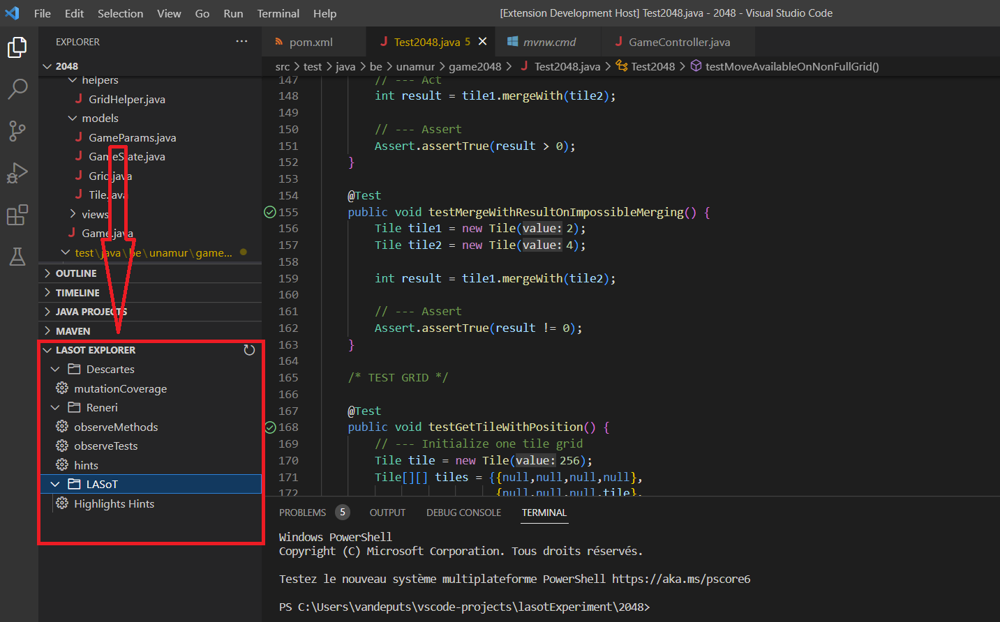

# LASoT : A Visual Studio Code plugin to visualize Descartes and Reneri reports 

LASoT plugin incorporates in Visual Studio Code informations generated by [Descartes](https://github.com/STAMP-project/pitest-descartes) engine and [Reneri](https://github.com/STAMP-project/descartes-reneri) to help students to refine the assertions of their tests. [Read more](https://github.com/STAMP-project/pitest-descartes#mutation-testing) about extreme mutation testing.

## Features

LASoT extension for VS Code provides : 

Explorer
 

The extension provides a treeView to execute Maven Descartes, Reneri and LASoT commands.   

- <strong>Descartes:mutationCoverage</strong> goal execute generates extreme transformations to the code and provides reports.  Those reports are accessibles in the target/pit-reports folder. 
- <strong>Reneri:observeMethods</strong> goal observes the execution of the original method and each transformed variant of the method. 
- <strong>Reneri:observeTests</strong> goal observes the execution of each test case for the original methods and the transformed variants. 
- <strong>Reneri:hints</strong> goal Generates improvement hints according to the results obtained with the execution of the two previous goals. 
- <strong>LASoT:highlightsHints</strong> goal decorates code based on the reporting of the previous goals. 

> To be able to display the decorations, at least the Descartes goal must be executed.  Descartes will indicate which methods is uncovered, partially or pseudo tested and which test must be improved.  Reneri gives more precise informations about the values of the original code and the transformation. To take advantages of Reneri reports each 3 goals must be executed in the presented order. 

Wizard
 

A Wizard to guide users to follow the steps correctly. To launch the wizard enter "LASoT Wizard" in the command palette (Ctrl+Shift+P). 

Status bar
 

Quick indication of survived mutations in the status bar. 

You can click on it to show more informations about the undected mutations.

Decorations
 

The extension decorates the signature of the methods in your classes and in the code of your tests suites.  It incorporates informations showed in an overlay when you hover the decoration.  

> Tips : Code highlighted is indicated with blue points in the minimap.  
> 

The overlay of <strong>signaled methods</strong> indicates the classification of this method (uncovered, partially-tested or pseudo-tested).  It also gives more informations about the undetected mutations and killed mutations.

The overlay of <strong>signaled tests</strong> indicates the value and type of the decorated part for the original version of the program and the undetected mutation.

## Requirements

The Java project on which this extension is applicated must includes Descartes and Reneri extensions.  Reneri extension needs an installation of [Maven](https://github.com/apache/maven) and set in the PATH variable to properly operates. 

