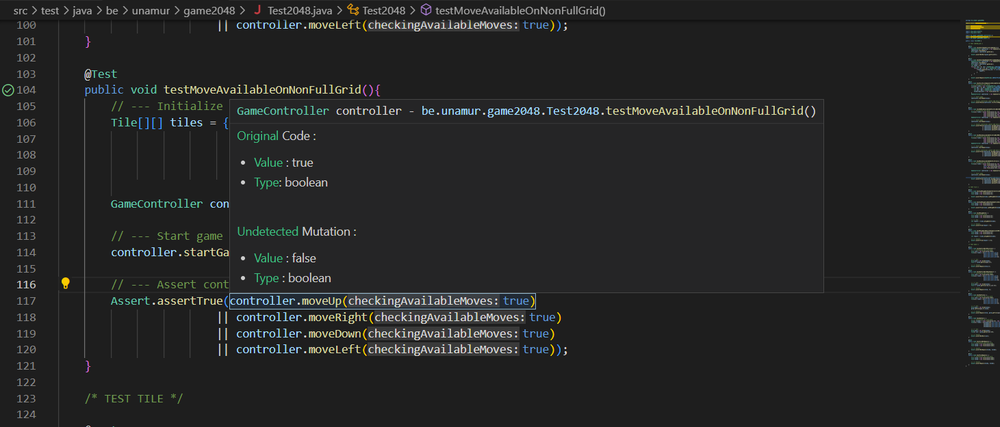

# LASoT : A visual studio code plugin to visualize Descartes and Reneri reports 

LASoT plugin incorporates in Visual Studio Code informations generated by [Descartes](https://github.com/STAMP-project/pitest-descartes) engine and [Reneri](https://github.com/STAMP-project/descartes-reneri) to help students to refine the assertions of their tests. [Read more](https://github.com/STAMP-project/pitest-descartes#mutation-testing) about extreme mutation testing.

## Features

LASoT extension for VS Code provides : 

LASoT Explorer
 

The extension provides a treeView to execute Maven Descartes, Reneri and LASoT commands.   

- <strong>Descartes:mutationCoverage</strong> goal execute generates extreme transformations to the code and provides reports.  Those reports are accessibles in the target/pit-reports folder. 
- <strong>Reneri:observeMethods</strong> goal observes the execution of the original method and each transformed variant of the method. 
- <strong>Reneri:observeTests</strong> goal observes the execution of each test case for the original methods and the transformed variants. 
- <strong>Reneri:hints</strong> goal Generates improvement hints according to the results obtained with the execution of the two previous goals. 
- <strong>LASoT:highlightsHints</strong> goal decorates code based on the reporting of the previous goals. 

To be able to display the decorations, each goals must be executed in the presented order (Descartes->Reneri->LASoT) 

Wizard
 

A Wizard to guide users to follow the steps correctly. To launch the wizard enter "LASoT Wizard" in the command palette (Ctrl+Shift+P). 

Status bar
 

Quick indication of survived mutations in the status bar. 

You can click on it to show more informations about the undected mutations.

Decorations
 

The extension decorates the signature of the methods in your classes and in the code of your tests suites.  It incorporates informations showed in an overlay when you hover the decoration.  

The overlay of signaled methods indicates the classification of this method (uncovered, partially-tested or pseudo-tested).  It also gives more informations about the undetected mutations and killed mutations.

The overlay of signaled tests indicates the value and type of the decorated part for the original version of the program and the undetected mutation.

## Usage

The extension provides shortcuts to Descartes and Reneri commands

Describe specific features of your extension including screenshots of your extension in action. Image paths are relative to this README file.

For example if there is an image subfolder under your extension project workspace:

\!\[feature X\]\(images/feature-x.png\)

> Tip: Many popular extensions utilize animations. This is an excellent way to show off your extension! We recommend short, focused animations that are easy to follow.

## Requirements

If you have any requirements or dependencies, add a section describing those and how to install and configure them.

## Extension Settings

Include if your extension adds any VS Code settings through the `contributes.configuration` extension point.

For example:

This extension contributes the following settings:

* `myExtension.enable`: enable/disable this extension
* `myExtension.thing`: set to `blah` to do something

## Known Issues

Calling out known issues can help limit users opening duplicate issues against your extension.

## Release Notes

Users appreciate release notes as you update your extension.

### 1.0.0

Initial release of ...

### 1.0.1

Fixed issue #.

### 1.1.0

Added features X, Y, and Z.

-----------------------------------------------------------------------------------------------------------
## Following extension guidelines

Ensure that you've read through the extensions guidelines and follow the best practices for creating your extension.

* [Extension Guidelines](https://code.visualstudio.com/api/references/extension-guidelines)

## Working with Markdown

**Note:** You can author your README using Visual Studio Code.  Here are some useful editor keyboard shortcuts:

* Split the editor (`Cmd+\` on macOS or `Ctrl+\` on Windows and Linux)
* Toggle preview (`Shift+CMD+V` on macOS or `Shift+Ctrl+V` on Windows and Linux)
* Press `Ctrl+Space` (Windows, Linux) or `Cmd+Space` (macOS) to see a list of Markdown snippets

### For more information

* [Visual Studio Code's Markdown Support](http://code.visualstudio.com/docs/languages/markdown)
* [Markdown Syntax Reference](https://help.github.com/articles/markdown-basics/)

**Enjoy!**
